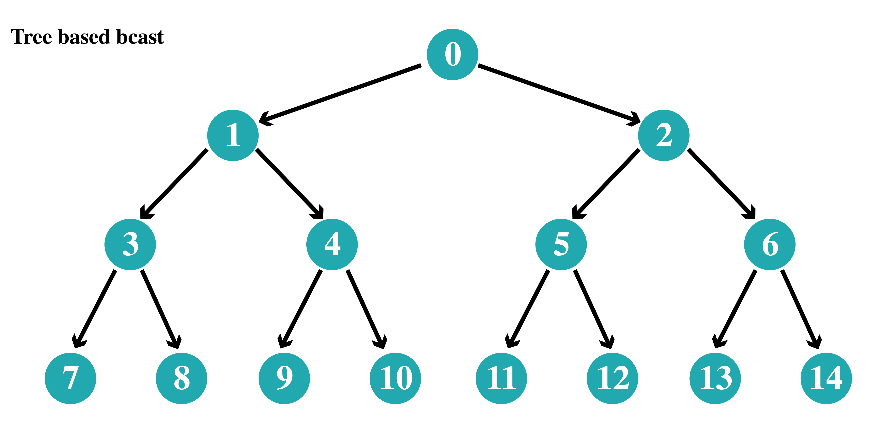
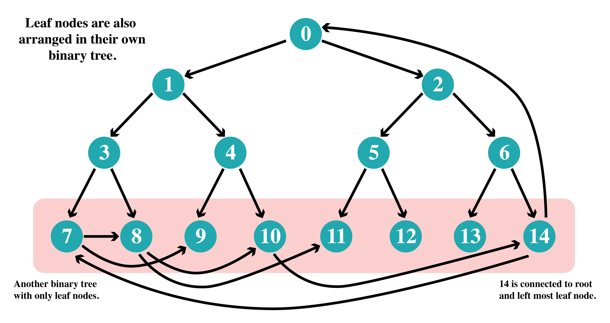
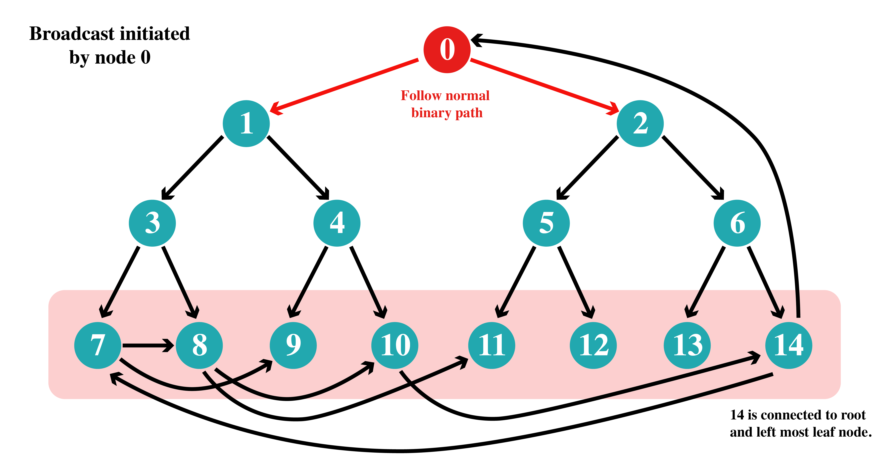
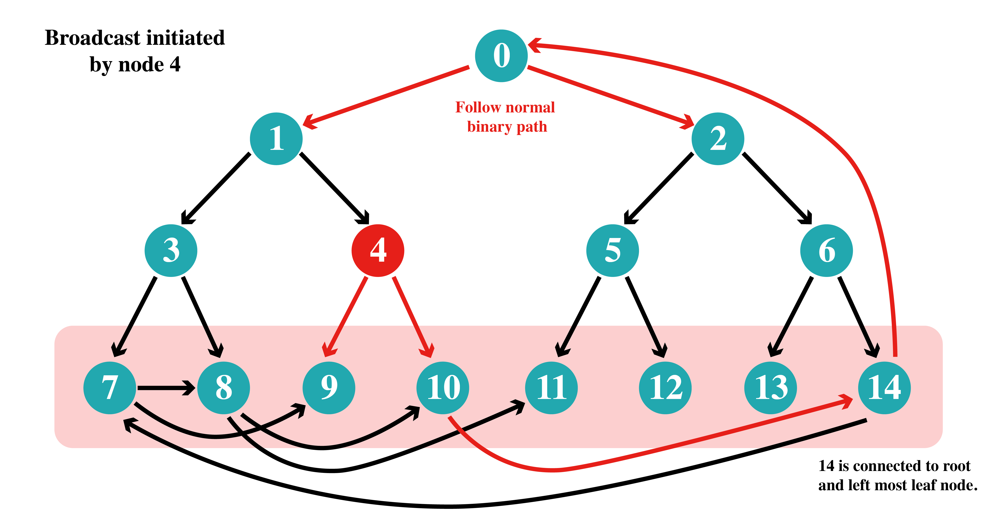
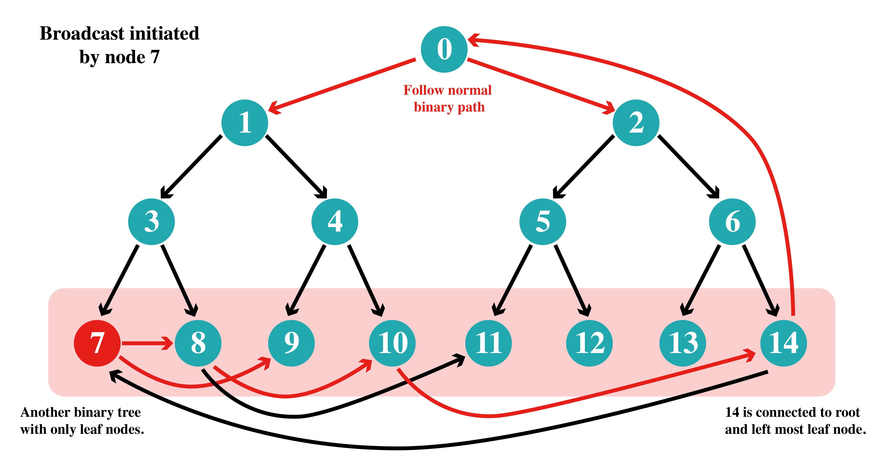

## Tree based distributed bcast across different nodes

This program shows how a broadcast is implemented across different nodes in a distributed system which are arranged in a binary tree like topology.

Any node can initiate a broadcast or send a message to be broadcasted. The message will flow from top to bottom of the tree as shown in the diagram.



Each node will only be responsible to send the message to it's 2 children who then will send it to it's children.

The algorithm will only take ```O(log n)``` steps instead of ```O(n)``` if a single nodes sends the message to everyone.

As the message flows only in one direction i.e. top to buttom. If node 4 broadcasts a message no node except 9 and 10 will receive the message.

To remove this constraint leaf nodes should be able to propagate the message to the root of the tree so that the message can reach every node.

This is done by connecting the last node of the tree (in this case, node 14) to the root node and all leaf nodes are connected to each other such that they form a binary tree to propagate messages in non-linear time/steps.

This is shown in the figure below.



Some connections (11, 12, 13) are not shown intentionally.

As the last level can have upto ```O(n/2)``` (more than half of the nodes of the entire graph) nodes. Propagating messages in a linear manner would be expensive. So, all leaf nodes can also be arranged in a binary tree (no relation with the first tree) for faster message propagation. This will also help in getting the message to the last node (node 14) as it propagates the message to root node.

Note: Some nodes might get duplicate messages which are dropped.

Below diagram shows how different nodes initiates bcast and path followed by the message.



This one is a trivial case where root node starts the bcast and the message is send to everyone in ```O(log n)``` steps



In this case a non-leaf node initiates the bcast. The message reaches some leaf node which sends it to the last node which pushes it to the root node from where it can follow the normal path.



In this case the leftmost leaf node initiates the bcast. Imaging the number of nodes being thousands. A binary tree in the leaf level can help us optimise the flow of message to all the leaf nodes and ultimately to the root node.